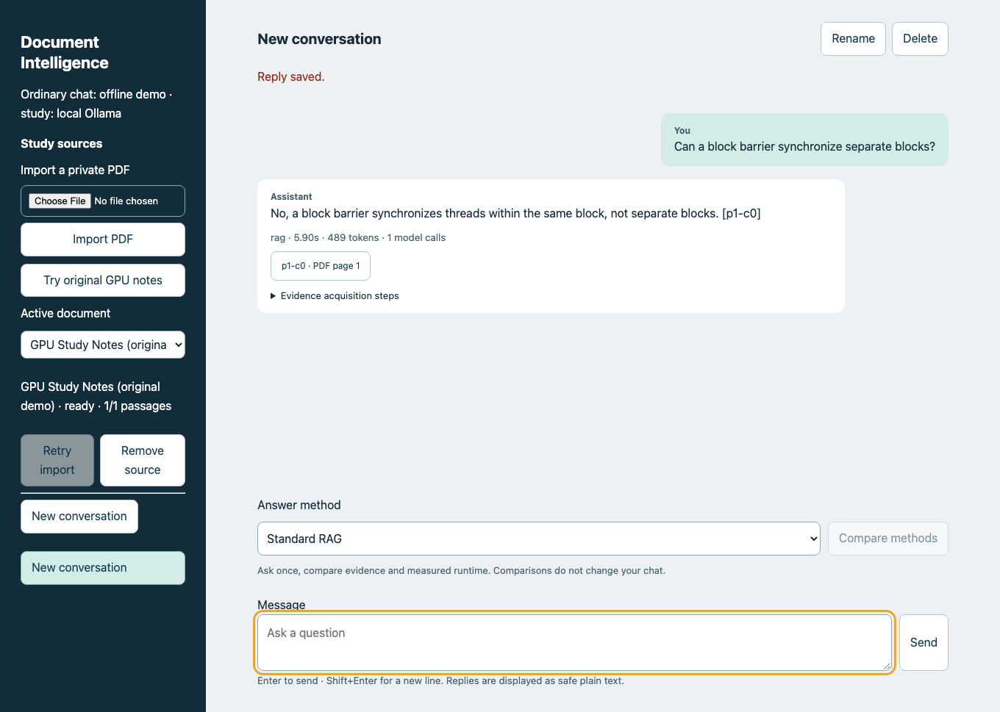
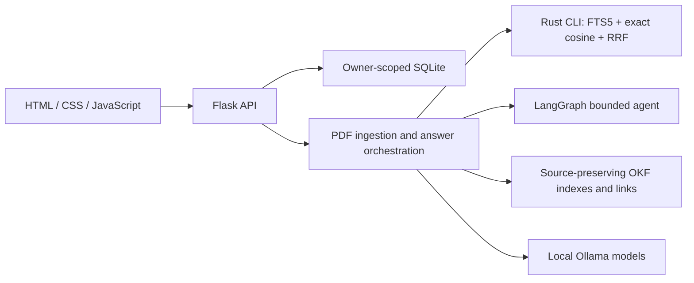

# Local Document Intelligence

A local study assistant for asking cited questions about documents and comparing how three methods find evidence. Flask and plain JavaScript provide the interface, Python handles ingestion and experiments, and a Rust engine performs retrieval.

Import a PDF, inspect the sources behind an answer, and compare standard RAG, a bounded LangGraph agent, and source-backed OKF navigation. Conversations, document indexes and comparison experiments persist in SQLite. The included original GPU notes let you try the product without the private textbook or paid credentials.



## Run locally

Prerequisites: Python 3.12 or 3.13, Make, a native Rust toolchain and Ollama. Start Ollama, then:

```sh
make setup
make models
make dev
```

Open http://127.0.0.1:5000. `make models` downloads `embeddinggemma`, `qwen3:4b` and a revision-pinned Qwen tokenizer locally. Ordinary chat uses an offline demo provider by default; document answering needs the local models. Direct Python dependencies and the Rust dependency lockfile are committed; broader Python dependency locking remains tracked in issue #10.

For a short demo:

1. Click **Try original GPU notes** and wait for the source to become ready.
2. Ask **Can a block barrier synchronize separate blocks?**
3. Open a citation to inspect the supporting text and page provenance.
4. Select another method, or click **Compare methods** to inspect three separate answers, timings, tokens, evidence and tool steps.
5. Reload the page: chat history persists, and the saved-experiment selector opens previous comparisons.

The interface supports import progress, failed-import retry, source removal, keyboard controls and narrow screens. Comparison answers are experiments and never enter subsequent conversation context. Execution steps show tool activity without exposing hidden reasoning. The functional UI retains the existing visual system; the larger Figma design remains pending selection of the owner's Figma team.

## Architecture



The repository stays flat: `app.py` defines the API, `storage.py` handles persistence, `gpt_handler.py` supplies ordinary chat providers, `knowledge.py` owns document ingestion and grounded answers, and `strategies.py` implements evidence-acquisition methods. `retrieval/` is one Rust crate, not a separate network service. Flask keeps its conventional `templates/` and `static/` directories; `tests/` has meaningful API, native-boundary, browser and evaluator boundaries. Evaluation lives in two root modules and publishes only permitted artifacts under `benchmarks/`.

Python invokes Rust through a versioned JSON interface with argument arrays, timeouts and structured errors. The engine stores source passages, vectors and FTS5 data in SQLite. PDF extraction records chapter/section titles from document outlines, PDF page numbers, independently detected printed page numbers and extraction warnings. Approximately 500-token chunks overlap by 75 tokens. Embedding caches include the document hash, extraction configuration and model digest.

Signed browser cookies identify owners; every document, conversation and experiment endpoint checks ownership. CSRF protects writes, and failed or conflicting chat turns roll back atomically. This supports local browser isolation; it does not provide accounts shared across devices. Additive schema changes preserve existing conversations. Source deletion removes the corpus, saved comparison experiments and stored passage copies; saved conversational answer text remains until its conversation is deleted.

## Three answering methods

| Method | Evidence acquisition | Bound |
| --- | --- | --- |
| Standard RAG | One hybrid lexical/dense retrieval, selecting five passages | One answer call |
| Agentic RAG | Plan a query, retrieve, assess support, retry if needed | Two retrieval rounds; at most five calls |
| OKF navigation | Select chapter/page-range indexes, then linked source passages; no vector search | Two navigation hops; at most three calls |

LangChain supplies the Ollama model adapters and structured interfaces. LangGraph supplies explicit state and bounded transitions for the agent. Neither framework replaces the Rust engine or owns database storage. OKF v0.2 is a linked Markdown format, not another model: generated bundles preserve source content, provenance and `draft` status, without claiming human verification.

All methods use `qwen3:4b`, thinking disabled, temperature zero, an 8,192-token context window, a 1,024-token output cap, the same citation/abstention instructions and a 3,072-token evidence budget. Document text is treated as untrusted evidence. The application validates citation IDs against supplied passages and abstains when evidence is missing. Valid IDs alone do not establish factual support.

## Verification

```sh
make test
make check
.venv/bin/pip install -r requirements-browser.txt
.venv/bin/python -m playwright install chromium
RUN_BROWSER=1 .venv/bin/python -m pytest -q tests/test_browser.py
node --check static/chat.js
```

Offline tests use original fixtures and fake providers. They cover ownership isolation, restart persistence, conflicts, atomic failed turns, source deletion during a request, citation validation, extraction provenance, malformed vectors, ranking, index compatibility, navigation limits, prompt boundaries, model failures, mobile layout and keyboard controls. CI runs Python tests/lint/type checks, Rust tests/format/clippy, browser acceptance and Docker build/restart smoke checks. Vanilla JavaScript has no frontend bundle build.

## Benchmarks and measured findings

[Methodology](benchmarks/README.md) documents the original 120-question suite, reference-review actors, controls, paired uncertainty intervals, frozen configurations and reproducible commands. [Findings](benchmarks/findings.md) states what is measured and what remains incomplete. Detailed answers, reference annotations and textbook passages stay private.

Development passage recall@5 on 20 source-reviewed answerable questions was **40.0% lexical, 60.0% dense and 67.5% hybrid**. Hybrid remains the default. This small retrieval result does not establish which answering method is best. Held-out generation/scoring, the 50-question QASPER probe, 50-example RAGBench evaluator calibration and 24-case independent audit must finish before a quality recommendation.

## Optional local Langfuse

The app and exports work without tracing. To start the separate development stack:

```sh
.venv/bin/python scripts/setup_observability.py
docker compose -p chatbot-local-observability --env-file instance/langfuse.env -f compose.langfuse.yaml up -d
set -a
. instance/langfuse.env
set +a
LANGFUSE_ENABLED=true make dev
```

Open http://localhost:3000. The ignored generated environment file contains the local developer login (`study@localhost.test`) and private password. Only the UI is exposed, on loopback; other services are internal. S3Mock supplies a development object store. Spans preserve allowlisted numeric metrics and omit arguments, model inputs/outputs and source content. Cloud trace endpoints are rejected and LangSmith tracing is disabled. Stop the stack with the same Compose command followed by `stop`; retain volumes for saved traces.

## API, privacy and limitations

`POST /api/documents` imports a multipart PDF up to 64 MiB; `/api/documents/demo` imports the original notes. Owner-scoped status, retry, delete and source-inspection routes are under `/api/documents/<id>`. The existing `/chat` accepts optional `document_id` and `method`; omission preserves ordinary chat. Separate comparison endpoints persist experiments without changing conversation context.

The private textbook, extracted text, embeddings, OKF bundle, detailed evaluations and trace credentials live in ignored `instance/` and are excluded from Docker build context. Keep that directory to preserve histories, ownership keys and caches. Never commit it. A single application process coordinates background ingestion; multi-process ingestion coordination is not implemented.

Text extraction can lose formulas and layout; figure-only questions are unsupported. Automated judges are fallible and share the generator model, so their scores are estimates requiring calibration and separate review. Private reference annotations are not distributed, limiting exact textbook reproduction from a fresh clone; the public demo and offline CI remain independently runnable.

The project began as ClayHR HR-support chatbot exploration. Historical notebooks remain archived context; the shipped app is the local document assistant. Ordinary OpenAI chat is optional and configured through `.env`, without source credentials. A historical credential-shaped notebook string still needs owner review under issue #4. Public hosting would require account authentication and abuse controls. No deployment or merge is part of these draft milestones; Compose readiness remains separate in PR #11.
