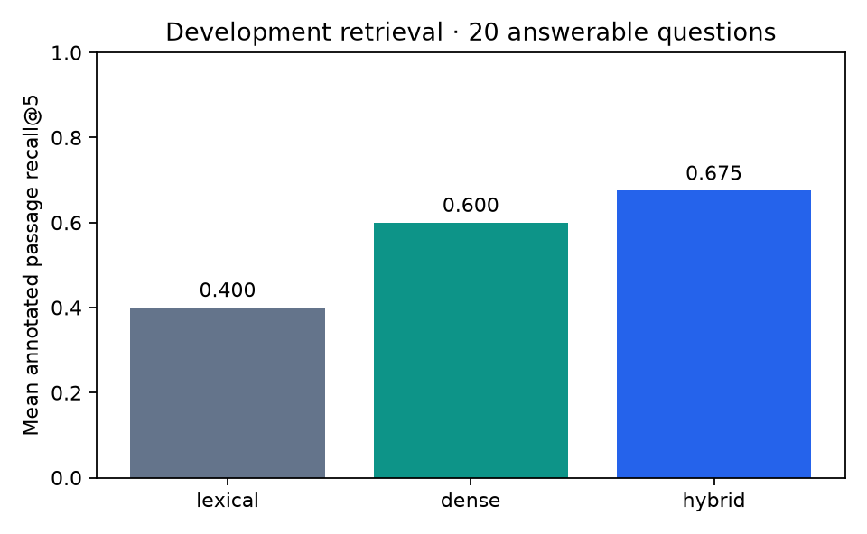
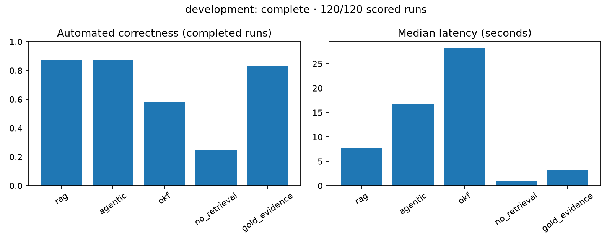

# Findings — work in progress

**No answering-method winner is established.** The long local evaluations are resumable; unfinished runs remain incomplete in the public status files.

## Completed source and retrieval work

The private textbook has 555 PDF pages, 1,040 chunks and a 15,544,320-byte SQLite index. One short/empty extraction page is flagged. Outline-aware ingestion took 65.83 seconds on an Apple M4 with 16 GiB memory and resident local models. This is one observation, not a cold-start baseline or performance improvement claim.

All 120 annotations were reviewed before held-out execution. Codex inspected the relevant extracted source passages for 100 source-backed cases and reviewed the scope of 20 unanswerable cases. No human or independent domain-expert verification is claimed. The earlier local-model annotation review flagged 22 cases; some verdicts contradicted their own arithmetic. Corrections and previous verdicts are retained privately.

| Retrieval mode | Mean annotated passage recall@5 | Questions |
| --- | ---: | ---: |
| Lexical FTS5 | 0.400 | 20 |
| Dense cosine | 0.600 | 20 |
| Hybrid reciprocal-rank fusion | 0.675 | 20 |

Hybrid retains the highest observed development mean and remains the default. The sample is small; paired intervals are in `retrieval-ablation-summary.json`. Passage-ID recall is sensitive to annotation coverage and chunk boundaries. It does not measure answer correctness, citation support or robustness on unseen domains.

## Preserved development pilot (v1)

All 120 initial development generations finished before the citation-contract correction. This is a pilot execution result; the revised development run below is reported separately.
Held-out replication remains incomplete.

| Condition | Completed answers | Rejected/failed runs | Successful median seconds |
| --- | ---: | ---: | ---: |
| Standard RAG | 18 / 24 | 6 | 7.33 |
| Agentic RAG | 18 / 24 | 6 | 16.29 |
| OKF navigation | 19 / 24 | 5 | 27.54 |
| No retrieval | 24 / 24 | 0 | 0.70 |
| Gold evidence | 22 / 24 | 2 | 2.70 |

Three private diagnostic replays reproduced citation-validation rejection, including a
gold-evidence case. They are excluded from benchmark results. The application fails closed
when answer citation IDs are missing or outside supplied evidence. Completed answers can
include appropriate abstentions; completion does not mean correctness. No-retrieval follows
the same abstention policy and is not a measure of unconstrained model knowledge.

`pilot-v1-development-generation-metrics.csv` and `pilot-v1-development-generation-summary.json` expose numeric
runtime metadata and failure counts, including failed-run latency separately. Failed turns do
not return complete token usage. The scored summary's latency statistics use successful
generations; the generation summary preserves failure timing. These small development timings
are observations on this hardware, without cold-start measurements or an answer-quality ranking.

The development failures motivated a revision **before any held-out execution**. The final
answer now has an explicit supported-answer/citation-list or abstention schema. Citation IDs
are constrained to supplied evidence; the adapter validates them before rendering source
links. This does not prove citation support or answer correctness, and it adds no model calls.
The old pilot and configuration remain preserved. New runs use a separate frozen v2 manifest
and journal; old answers are not silently replaced or mixed into the comparison.

## Completed development comparison (v2)

All 120 revised development generations and scores are complete, with zero generation or
scoring failures. Each condition has 24 questions. Correctness below is an automated estimate,
combined with deterministic numeric checks where applicable; it is not expert-verified accuracy.

| Condition | Automated correctness | Cited-answer support | Passage recall | Median seconds | Mean model calls |
| --- | ---: | ---: | ---: | ---: | ---: |
| Standard RAG | 21/24 (87.5%) | 18/19 | 0.675 | 7.81 | 1.00 |
| Agentic RAG | 21/24 (87.5%) | 18/19 | 0.650 | 16.80 | 3.17 |
| OKF navigation | 14/24 (58.3%) | 10/12 | 0.150 | 28.11 | 2.88 |
| No retrieval | 6/24 (25.0%) | Not applicable | 0.000 | 0.85 | 1.00 |
| Gold evidence | 20/24 (83.3%) | 17/19 | 1.000 | 3.20 | 0.83 |

Passage recall has 20 answerable cases per condition. Citation support is conditional on
answers that actually cite evidence, so its denominator differs; it does not count abstentions
as grounded answers. Citation IDs were syntactically valid throughout. Abstention accuracy
was 23/24 for RAG and agentic, 16/24 for OKF, 8/24 for no retrieval, and 23/24 for gold evidence.
Gold-evidence unanswerable controls abstain without calling the generator, reducing their mean
calls and latency. Token totals, percentile timings, category scores, supplemental Ragas scores
and denominators are in the aggregate CSV/JSON files.

RAG's median elapsed time was lower on this development set. RAG and agentic had equal
estimated correctness; OKF scored lower after rejecting incorrect abstentions. The agent/RAG outcomes match on these 24 binary judgments, producing a
zero-width observed paired bootstrap interval; this does not prove population equivalence.
OKF minus RAG has mean paired correctness difference -0.292 and an interval of [-0.500, -0.042].
Gold evidence scoring below RAG still warrants scrutiny of judge reliability and annotation
coverage. These are development observations, not a final ranking.

### Transparent grading correction

The first development scoring pass marked explicit abstentions incorrect even when the answer
exactly matched the reviewed unanswerable reference. Grading revision
`v2.2-reviewed-abstention-policy` uses the reviewed label and explicit abstention for those
cases, rejects abstention on answerable cases, and excludes uncited answers from the
citation-support denominator. The development consistency check found seven OKF and twelve
no-retrieval abstentions incorrectly accepted by the semantic judge. The intermediate v2.1
pass corrected unanswerable cases but still rewarded those answerable-case abstentions; its
artifacts are preserved as `grading-v2.1-*`. Existing development
answers were regraded deterministically without new generation or judge calls. The original
scores, chart and configuration are preserved as `judge-pilot-*`.

This correction occurred after held-out generation started, but before any held-out scoring or
inspection of its outputs. Corpus, annotations, methods, model digests, prompts, budgets and
generation functions were unchanged; hashes and the correction are recorded in the manifest.
QASPER uses the same labeled-unanswerable rule. This disclosure limits any claim that the
entire grading implementation was frozen before the held-out generation began.

The local evaluation processes ended after 217 held-out generation records. Resumption keeps
those records; a restarted service can introduce model loading time on its first subsequent
calls. Load times remain recorded separately. No consistent cold/warm timing or speedup claim
is made across that interruption. Full held-out scoring, external experiments and audit remain
incomplete.

## Evaluation status

- The frozen textbook comparison has 24 development questions and 96 held-out questions across six categories. Five conditions include standard RAG, agentic RAG, OKF navigation, no-retrieval and gold-evidence controls. Three held-out repetitions require 1,440 generation runs plus separate scoring.
- `development-summary.json` and `heldout-summary.json` report recorded generation, scoring coverage, failures, metric denominators, latency percentiles and paired intervals. CSV exports contain permitted metrics only.
- `external-summary.json` tracks the separate 150-run QASPER experiment and 50-example RAGBench evaluator calibration. Calibration is not end-to-end retrieval performance.
- `audit-sample-ids.json` selects 24 stratified held-out cases for separate inspection of generated answers, source support and judge disagreements. Selection alone is not a completed audit.

## Known errors and interpretation limits

The annotation pilot exposed judge inconsistency, motivating direct source inspection and explicit review actors. Numeric presence checks now require agreement with the semantic correctness judge; an incidental matching number cannot alone establish correctness. Ragas faithfulness and relevance remain supplemental estimates from the same small local model. Scoring failures/nulls are preserved, and sample sizes accompany aggregates.

The text extractor cannot resolve figure-only evidence and can distort mathematics or code layout. Follow-up retrieval may miss context that a bounded agent can reformulate; that is a hypothesis to evaluate, not a measured advantage. OKF navigation must choose among page-range indexes under a two-hop limit; it is not built from benchmark answers. Extra model calls can cost time without improving quality.

A recommendation will require complete comparisons, uncertainty intervals, external calibration and the 24-case audit. An inconclusive outcome is acceptable. Until then, use the standard RAG default for its simpler execution path, without claiming superior measured answer quality.
